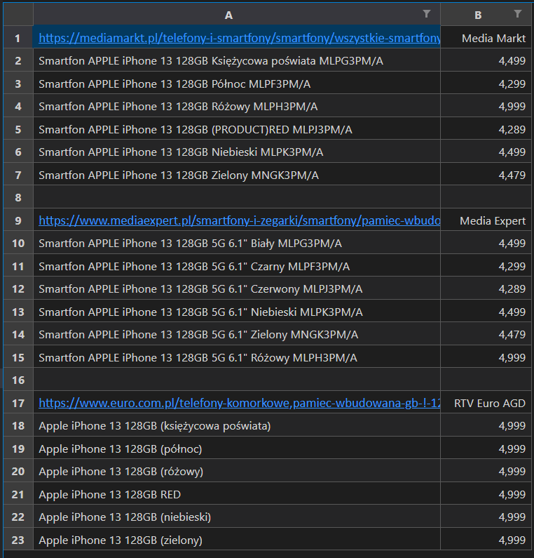

## Smartphone price comparer
This project was made to automate the process of comparing phone prices between 3 different shops:                                    
- Media Markt
- Media expert
- RTV Euro AGD

After giving the program specific inputs, it will create an excel file with what was found on each shop.

## Example
> python .\Small_projects\smartphone_price_comparer\smartphone_price_comparer.py

## The excel file
This will be shown (the excel file may be different for you because some phone can be sold out) if we look for iphone 13:
